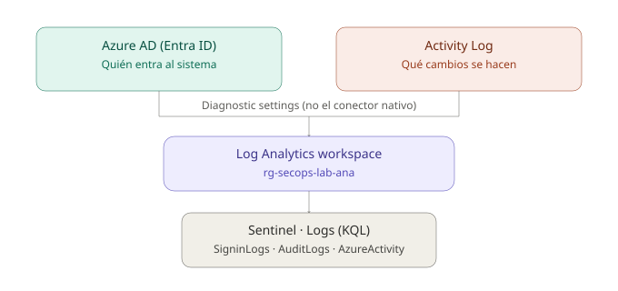
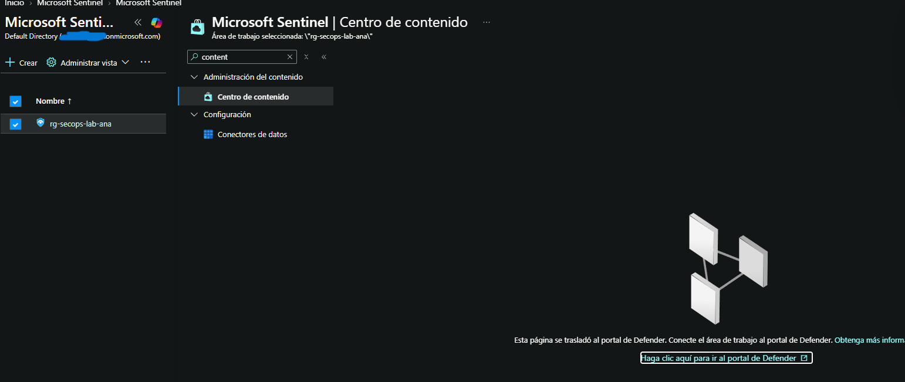
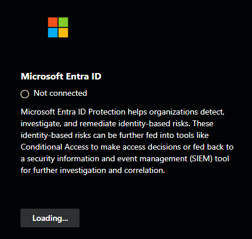
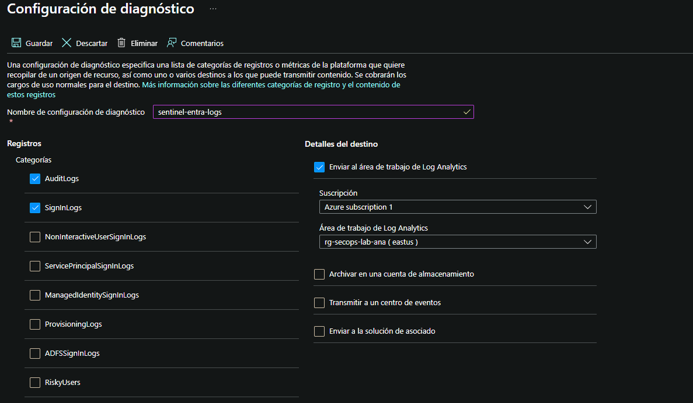
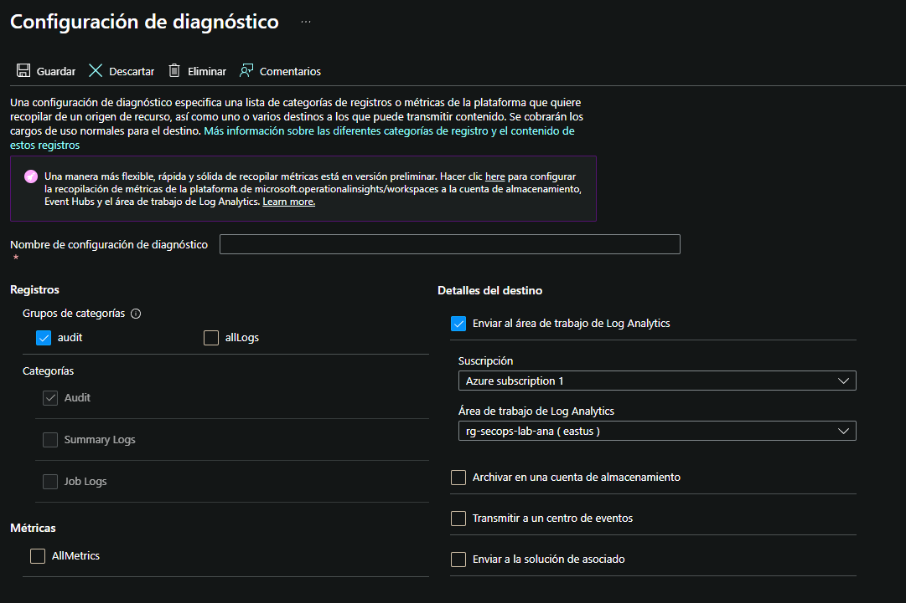
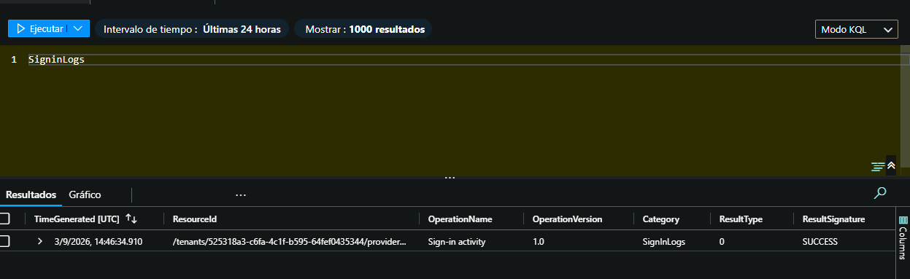
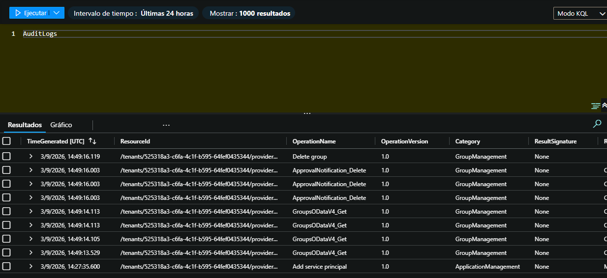
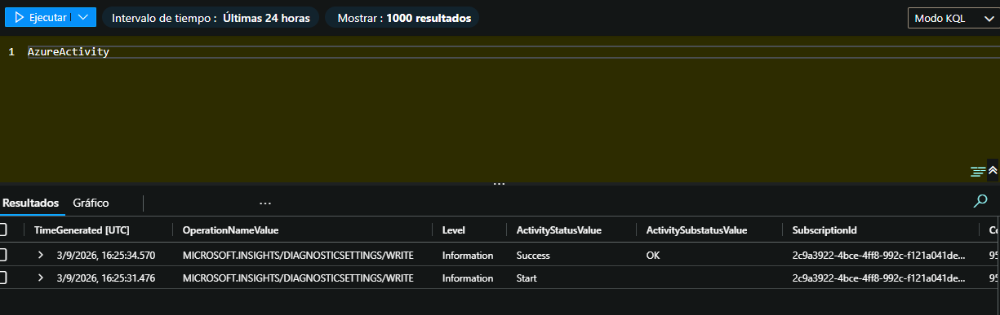

# Fase 2 — Conectar las fuentes de datos

## De qué va esto

Con Sentinel ya instalado (Fase 1) tocaba "encenderlo" de verdad: darle
datos reales que analizar. Un SIEM sin logs es como una cámara de
seguridad apagada — está instalada, pero no está viendo nada. En esta
fase conecté dos fuentes distintas, cada una respondiendo a una pregunta
diferente:

- **Azure AD (Entra ID)** responde a *"¿quién está entrando?"*
- **Activity Log** responde a *"¿qué se está tocando?"*

## Antes de nada: presupuesto de seguridad

Antes de tocar ningún conector, dejé montada una alerta de presupuesto en
Cost Management (ver Fase 1) para no llevarme sorpresas de coste mientras
iba probando cosas. Resultó útil de verdad: en mitad de esta fase creí
ver un gasto de $30 en una vista rápida del portal, y gracias a tener
Cost Analysis ya configurado pude comprobar en segundos que el coste real
era $0 — solo fue una lectura confusa de una pantalla que no reflejaba
bien el estado, no un cargo real.

## Conectando Azure AD: el obstáculo real

El plan inicial era usar el conector nativo de Sentinel para Azure AD. Al
intentarlo, el portal me llevó primero al **Centro de contenido**, que
ahora redirige al portal unificado de Microsoft Defender (Microsoft movió
la gestión de conectores ahí):

Dentro del portal de Defender encontré el conector correcto, llamado
**Microsoft Entra ID** :

Pero al intentar conectarlo, se quedó colgado en "Loading..." de forma
indefinida:

**Por qué pasó esto:** investigando después, confirmé la causa exacta —
este conector concreto es el de **Microsoft Entra ID Protection**, una
funcionalidad que requiere licencia Microsoft Entra ID P2 para
funcionar. Con una licencia gratuita, el conector se queda esperando una
respuesta de un servicio al que no tengo acceso, sin dar un error claro.
Fuente: [documentación oficial de Microsoft Entra ID Protection](https://learn.microsoft.com/en-us/entra/id-protection/overview-identity-protection).

## La solución: Diagnostic settings

En vez de insistir con el conector bloqueado, usé **Diagnostic
settings** — un mecanismo más manual pero que no depende de licencias
especiales: le dices a un recurso de Azure "cada vez que pase algo,
mándaselo también a este Log Analytics workspace".

Lo configuré en Microsoft Entra ID, marcando las categorías `AuditLogs`
y `SignInLogs`, con destino mi workspace `rg-secops-lab-ana`:

Y por separado, a nivel de suscripción, para **Activity Log**:

## Verificación: generar eventos de prueba

Configurar algo y que no dé error no significa que funcione — quise
comprobarlo con datos reales, no solo fiarme del estado "Connected".

**SigninLogs** — se confirmó solo con un inicio de sesión normal en el
portal:

**AuditLogs** — tardó más en aparecer que SigninLogs. Para forzarlo,
generé una acción administrativa real (crear/borrar un grupo de prueba en
Entra ID), y entonces sí aparecieron entradas como `Delete group` o
`Add service principal`:

**AzureActivity** — fue el más tozudo de los tres. Ni la tag `test:test`
que añadí al resource group ni esperar un rato generaron nada visible.
Al final **creé (y borré) un Storage Account de prueba**
(`teststoragedasdfsgs`, tier estándar LRS, el más barato) para forzar una
acción administrativa clara e inequívoca — y ahí sí apareció:

## Definiciones cortas

- **Diagnostic settings**: mecanismo de Azure para reenviar logs de un
  recurso hacia un destino (como un Log Analytics workspace), sin pasar
  por un conector visual dedicado.
- **Log Analytics workspace**: la base de datos donde caen todos los logs;
  Sentinel consulta este workspace, no almacena nada por sí mismo.
- **AuditLogs**: registro de cambios administrativos en Entra ID (crear,
  modificar o borrar usuarios, grupos, aplicaciones...).
- **SigninLogs**: registro de cada inicio de sesión (interactivo) en el
  tenant, con su resultado (éxito/fallo).
- **AzureActivity**: registro de operaciones sobre recursos de Azure a
  nivel de suscripción (crear, modificar, borrar recursos).
- **Microsoft Entra ID Protection**: funcionalidad de detección de riesgo
  de identidad (logins sospechosos, credenciales filtradas...); requiere
  licencia P2, distinta de simplemente tener Entra ID.
- **KQL (Kusto Query Language)**: el lenguaje de consulta usado en Log
  Analytics y Sentinel para leer y filtrar los logs.

## A tener en cuenta

- Los cambios de configuración de diagnóstico no son retroactivos — solo
  capturan eventos a partir del momento en que se guardan.
- El conector nativo de Entra ID en el portal de Defender se quedó sin
  resolver (sigue en "Loading..."), pero no bloquea nada — los datos ya
  llegan por la vía alternativa. No hizo falta arreglarlo, solo rodearlo (entiendo que es por la licencia).
- Cost Analysis puede tardar en sincronizar; para tranquilidad inmediata,
  el presupuesto con alertas por email sigue siendo la red de seguridad
  más fiable.
