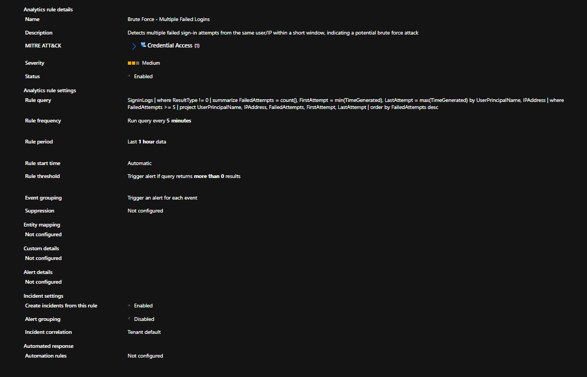
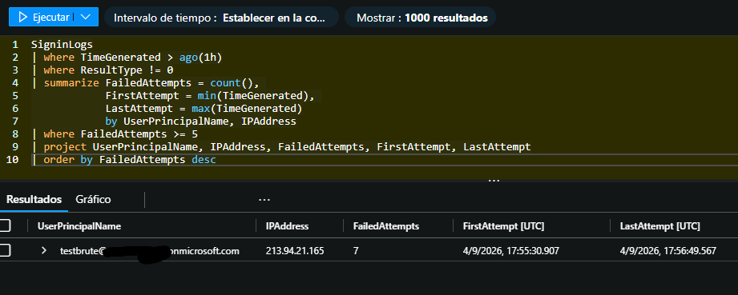
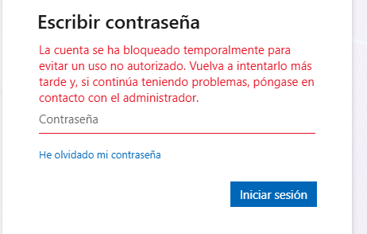
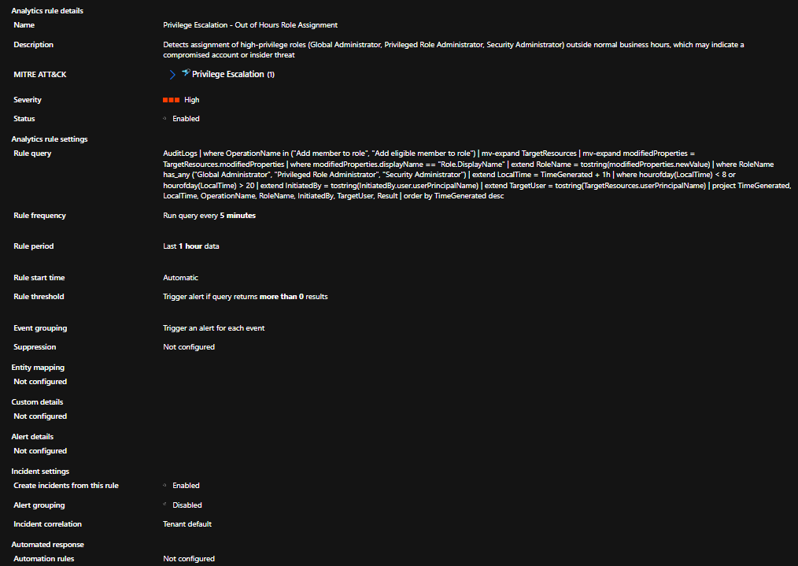
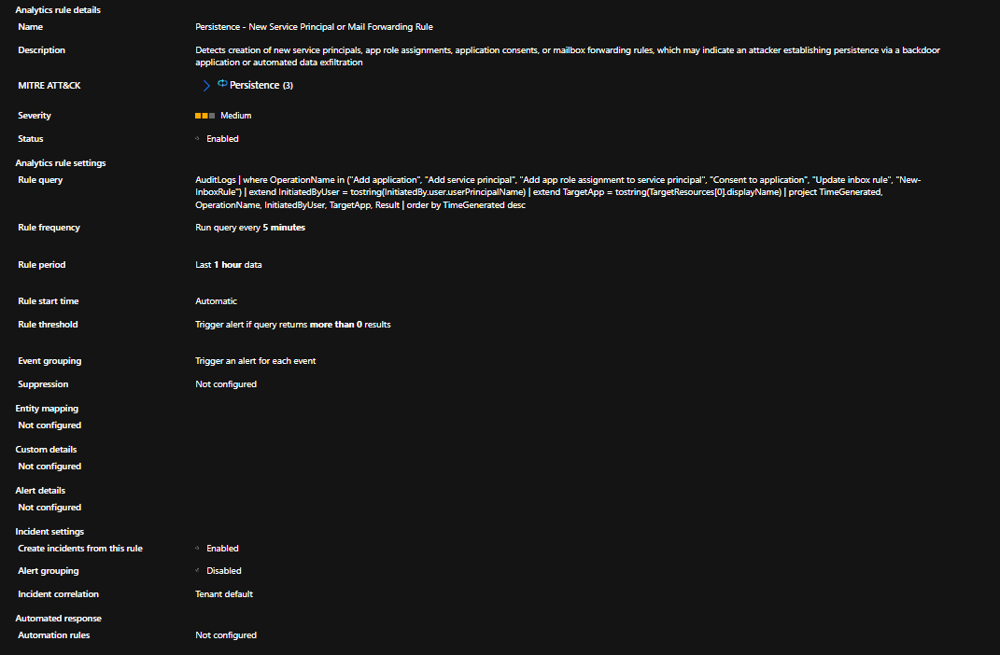
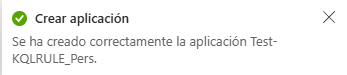
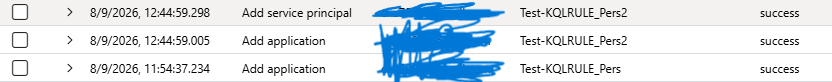
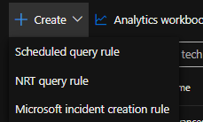

# Fase 3 — Detecciones KQL

## De qué va esto

Con los datos ya llegando al workspace (Fase 2), tocaba la parte que da
sentido a todo lo anterior: escribir las reglas que convierten "logs en
crudo" en algo que un analista pueda triagear. En Sentinel esto se llama
**Analytics Rule** — una query KQL que corre periódicamente y, si
encuentra algo que cumple la condición definida, genera una alerta.

Lo curioso de esta fase es que, antes de escribir una sola query, ya
llevaba un buen rato peleándome con algo mucho más tonto: **ni siquiera
podía entrar a la pantalla de Analytics**. Cada vez que hacía clic, el
portal de Defender me devolvía en bucle a la pantalla de conectores,
como si el workspace no estuviera conectado — aunque sí lo estaba. Llegué
a dudar si era algo que había roto yo, hasta que busqué el síntoma
exacto y encontré a varios usuarios en los foros de Microsoft Q&A
describiendo lo mismo, incluso con permisos de Global Admin y licencia
E5 de por medio. Eso me tranquilizó bastante: no era un error mío, era
un bug conocido de la plataforma. Cuento la causa real (un resource
group fantasma que quedó de la Fase 1) y cómo lo resolví más abajo.

En esta fase diseñé y creé tres reglas, cada una mapeada a una táctica
distinta de MITRE ATT&CK, y cada una pensada para cubrir un vector de
ataque diferente sobre la capa de identidad del tenant:


## Las 3 reglas

### 1. Brute Force - Multiple Failed Logins

| | |
|---|---|
| **MITRE ATT&CK** | Credential Access — T1110 |
| **Severidad** | Medium |
| **Fuente** | `SigninLogs` |



```kql
SigninLogs
| where ResultType != 0
| summarize FailedAttempts = count(),
            FirstAttempt = min(TimeGenerated),
            LastAttempt = max(TimeGenerated)
            by UserPrincipalName, IPAddress
| where FailedAttempts >= 5
| project UserPrincipalName, IPAddress, FailedAttempts, FirstAttempt, LastAttempt
| order by FailedAttempts desc
```

**Qué hace, rápido:** coge todos los logins (`SigninLogs`), se queda solo
con los que fallaron (`ResultType != 0`, 0 sería éxito), y los agrupa por
usuario + IP contando cuántos fallos hay de cada combinación
(`summarize ... by`). Si esa combinación tiene 5 fallos o más, la deja
pasar; el resto lo descarta. Al final ordena de más a menos intentos
para ver primero los casos más graves.

**Por qué está construida así:** el umbral de 5 intentos fallidos se
aplica dentro de la propia query (`FailedAttempts >= 5`), no en el
"Alert threshold" del wizard — ahí simplemente pido "más de 0
resultados", porque cualquier fila que devuelva la query ya es, por
definición, un caso que supera el umbral. Poner el umbral dos veces (en
la query y en el wizard) es un error común que hace que la regla nunca
dispare, lo se por que me ha pasado, sino no lo sabría :).

**Validación:** generé intentos fallidos reales contra una cuenta de
prueba creada específicamente para esto en Entra ID (la misma que usé en
Fase 2 para simular brute force, sin conexión con ninguna cuenta
personal). La query devolvió 7 intentos fallidos desde la misma IP en
una ventana de un minuto:



Como curiosidad, la propia protección nativa de Entra ID bloqueó la
cuenta temporalmente tras el volumen de intentos — una validación extra
de que el comportamiento generado era realista:



### 2. Privilege Escalation - Out of Hours Role Assignment

| | |
|---|---|
| **MITRE ATT&CK** | Privilege Escalation — T1098 (Account Manipulation) |
| **Severidad** | High |
| **Fuente** | `AuditLogs` |



```kql
AuditLogs
| where OperationName in ("Add member to role", "Add eligible member to role")
| mv-expand TargetResources
| mv-expand modifiedProperties = TargetResources.modifiedProperties
| where modifiedProperties.displayName == "Role.DisplayName"
| extend RoleName = tostring(modifiedProperties.newValue)
| where RoleName has_any ("Global Administrator", "Privileged Role Administrator", "Security Administrator")
| extend LocalTime = TimeGenerated + 1h
| where hourofday(LocalTime) < 8 or hourofday(LocalTime) > 20
| extend InitiatedBy = tostring(InitiatedBy.user.userPrincipalName)
| extend TargetUser = tostring(TargetResources.userPrincipalName)
| project TimeGenerated, LocalTime, OperationName, RoleName, InitiatedBy, TargetUser, Result
| order by TimeGenerated desc
```

**Qué hace, rápido:** parte de `AuditLogs` y se queda solo con
operaciones de asignar un rol a alguien. Los dos `mv-expand` "abren" los
datos anidados que trae el log (qué recurso se tocó, qué propiedad
cambió) para poder trabajar con ellos como columnas normales, en vez de
un array. Con eso ya desplegado, se queda con la fila que dice qué rol
se asignó (`RoleName`) y descarta todo lo que no sea un rol de alto
privilegio. Después convierte la hora UTC del log a tu hora local
(`+1h`) y filtra solo lo que ocurrió antes de las 8:00 o después de las
20:00. Por último saca quién hizo el cambio y a quién se lo hizo.

**Por qué usa `mv-expand` en vez de indexar `TargetResources[0]`:** la
primera versión de esta query accedía directamente a
`TargetResources[0].modifiedProperties[1].newValue`, asumiendo que el
nombre del rol siempre estaba en esa posición exacta del array, otra
cosa que aprendí al verificar y ver que no me salía nada. Ese
orden no está garantizado por Azure — puede cambiar según el tipo de
operación. La solución fue "desplegar" los arrays con `mv-expand` y
buscar la propiedad por su nombre real (`Role.DisplayName`) en vez de
por posición. Es más verbosa, pero no depende de un orden que puede
romperse sin aviso.

**Validación:** pendiente. Esta regla solo dispara si la asignación de
rol ocurre fuera de la franja 8:00–20:00, así que la prueba real hay que
hacerla de noche — queda anotada para la siguiente sesión.

### 3. Persistence - New Service Principal or Mail Forwarding Rule

| | |
|---|---|
| **MITRE ATT&CK** | Persistence — T1098.001, T1136, T1114.003 |
| **Severidad** | Medium |
| **Fuente** | `AuditLogs` |



```kql
AuditLogs
| where OperationName in ("Add application", "Add service principal", "Add app role assignment to service principal", "Consent to application", "Update inbox rule", "New-InboxRule")
| extend InitiatedByUser = tostring(InitiatedBy.user.userPrincipalName)
| extend TargetApp = tostring(TargetResources[0].displayName)
| project TimeGenerated, OperationName, InitiatedByUser, TargetApp, Result
| order by TimeGenerated desc
```

**Qué hace, rápido:** parte de `AuditLogs` y se queda solo con las
operaciones que nos interesan — crear una app/service principal, o crear
una regla de reenvío de correo. De cada evento saca en columnas propias
quién lo hizo (`InitiatedByUser`) y sobre qué aplicación
(`TargetApp`), y ordena los resultados del más reciente al más antiguo.

**Qué cubre y por qué:** dos vectores de persistencia distintos en una
sola regla — un atacante con acceso puede crear una app registration con
permisos de API como puerta trasera (`Add application`, `Add service
principal`, `Consent to application`), o crear una regla de reenvío
automático de correo para exfiltrar información sin que el usuario
legítimo lo note (`Update inbox rule`, `New-InboxRule`).

**El error real que encontré al validarla:** la primera versión de la
query solo buscaba `"Add service principal"`. Al crear una Enterprise
Application de prueba (`Test-KQLRULE_Pers`) para validar la regla, no
aparecía nada — ni en la query ni, evidentemente, como incidente. En vez
de asumir que el problema estaba en la regla, comprobé qué operación
generaba Azure *de verdad* al crear una app:



El operation name real era **`Add application`**, no `Add service
principal` — un nombre parecido pero distinto, que no estaba en mi
lista. Añadí `"Add application"` a la query y repetí la prueba con una
segunda app (`Test-KQLRULE_Pers2`), esta vez sí capturada:



Este es exactamente el tipo de ajuste que documento en detalle: no basta
con que una query "tenga sentido" sobre el papel, hay que confirmarla
contra el nombre exacto que usa la plataforma.

## Tipos de regla en Sentinel

Al crear una regla nueva, el wizard ofrece varios tipos — vale la pena
saber la diferencia antes de elegir:



- **Scheduled query rule**: la que usé para las 3 reglas de esta fase.
  Corre una query KQL cada X minutos sobre una ventana de tiempo
  configurable. Es el tipo estándar para detecciones personalizadas.
- **NRT (Near Real-Time) query rule**: variante que corre cada minuto en
  vez de cada 5+ minutos, pensada para detecciones muy urgentes. Tiene
  más restricciones (menos funciones KQL disponibles) a cambio de la
  velocidad.
- **Microsoft incident creation rule**: no ejecuta una query propia,
  simplemente convierte automáticamente en incidente de Sentinel las
  alertas que ya generan otros productos Microsoft conectados (Defender
  for Cloud, Defender for Identity...).

## El obstáculo grande: el motor de evaluación no generaba nada

Antes de llegar a crear las reglas, Analytics ni siquiera cargaba —
el portal de Defender se quedaba en bucle redirigiendo a la pantalla de
conectores. La causa (un resource group fantasma residual del duplicado
de Fase 1) y la solución completa las documento en detalle en la Fase 6,
como parte de la dificultad real del proyecto con la migración de
portal.

Pero una vez resuelto eso y con las 3 reglas ya creadas, apareció un
segundo problema, más sutil: **ninguna regla generaba alertas ni
incidentes**, ni siquiera la regla de ejemplo que trae Sentinel por
defecto. Lo confirmé consultando directamente la tabla que alimenta las
alertas del portal Defender:

```kql
AlertInfo
| where Timestamp > ago(3h)
| project Timestamp, Title, ServiceSource, Severity
| order by Timestamp desc
```

Vacía. Cero alertas en 3 horas, de cualquier regla. Descarté por orden:
permisos (soy Owner de la suscripción), configuración de la regla
(`Create incidents from this rule` estaba en `Enabled`), y sintaxis de
la query (funcionaba perfectamente al ejecutarla a mano en Logs). Con
todo eso descartado, la conclusión es que el motor de evaluación
automática en background no está corriendo sobre este workspace —
probablemente otro resto del mismo problema de sincronización con
Defender.

**Workaround mientras se resuelve (ticket abierto a soporte de
Microsoft):** cada vez que necesito confirmar que una regla detecta
correctamente, genero el evento de prueba y ejecuto la query
manualmente en Logs — exactamente el mismo criterio (query, ventana de
tiempo) que usaría la regla automática, solo que disparado a mano en vez
de esperar al ciclo programado. No es el flujo ideal de un SOC real,
pero permite seguir validando el diseño de las detecciones sin bloquear
el resto del proyecto.

## Estado de la fase

Esta fase se considera **funcionalmente completa**: las 3 reglas están
diseñadas, creadas en Sentinel, y validadas contra datos reales (Brute
Force y Persistence confirmadas con evidencia; Privilege Escalation
pendiente solo de una validación nocturna por la naturaleza de su
condición horaria — no bloqueada por ningún problema técnico).


## Definiciones clave

- **Analytics Rule**: una query KQL programada que Sentinel ejecuta
  periódicamente; si el resultado supera el umbral definido, genera una
  alerta.
- **Alert vs Incident**: una *alerta* es lo que dispara la regla. Un
  *incidente* es el contenedor donde una o más alertas se agrupan para
  que un analista las trabaje (asignar, investigar, cerrar). Sin
  incidentes, las alertas no llegan a ninguna cola de trabajo.
- **Alert threshold**: condición sobre el número de filas que devuelve
  la query para decidir si se genera una alerta (p. ej. "más de 0
  resultados").
- **Event grouping**: decide si cada fila de resultado genera su propia
  alerta individual, o si se agrupan varias en una sola. Elegí "una
  alerta por evento" en las tres reglas para maximizar la práctica de
  triage por caso individual en la siguiente fase.
- **`mv-expand`**: operador KQL que "despliega" un array en varias filas,
  una por elemento. Útil para no depender de la posición de un elemento
  dentro del array, que puede no estar garantizada.

## Tabla de errores

| Qué pasó | Causa real | Cómo se resolvió |
|---|---|---|
| La query de Persistence no devolvía nada al crear una app de prueba | Azure genera el evento como `Add application`, no `Add service principal` como asumía la query original | Se comprobó el nombre real del operation en `AuditLogs` y se añadió `"Add application"` a la lista |
| La query de Privilege Escalation fallaba/daba datos poco fiables | Se indexaba `TargetResources[0].modifiedProperties[1]` por posición, que no está garantizada por Azure | Se reescribió con `mv-expand` para buscar la propiedad por nombre (`Role.DisplayName`) en vez de por posición |


## Pendiente dentro de esta fase 

- Validar la regla de Privilege Escalation generando un evento real
  fuera de la franja 8:00–20:00